# ☕ The Cafeteria

<b>😉 Heyyy !! Nice To See you!! </b> I made cafeteria website using php with login/register authentication (using mysql database)

<b> Link - </b> <a href= "https://thecafeteria.000webhostapp.com/">https://thecafeteria.000webhostapp.com/</a>
____

# ✨ Some Salient Feature

- [x] <i>🔐 Login/Register Authentication</i> 
- [x] <i>🐇 Form Validation Using Ajax</i> 
- [x] <i>🔑 Password Stored Encrypted In Database Using PHP Encryption (Hash-12)</i> 
- [x] <i>📧 Message is send to mail using <a href="https://github.com/PHPMailer/PHPMailer">PHP Mailer Libraray</a></i> 

____

# 📹 Video
⏩ - 3x
<br><br>


___

# 📸 Screenshots

## Home Page

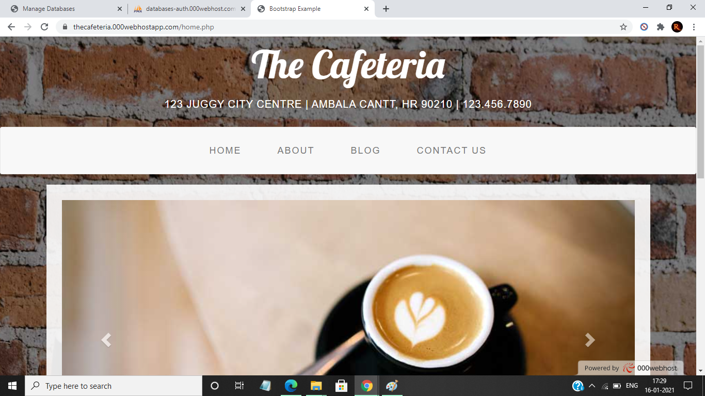&nbsp;&nbsp;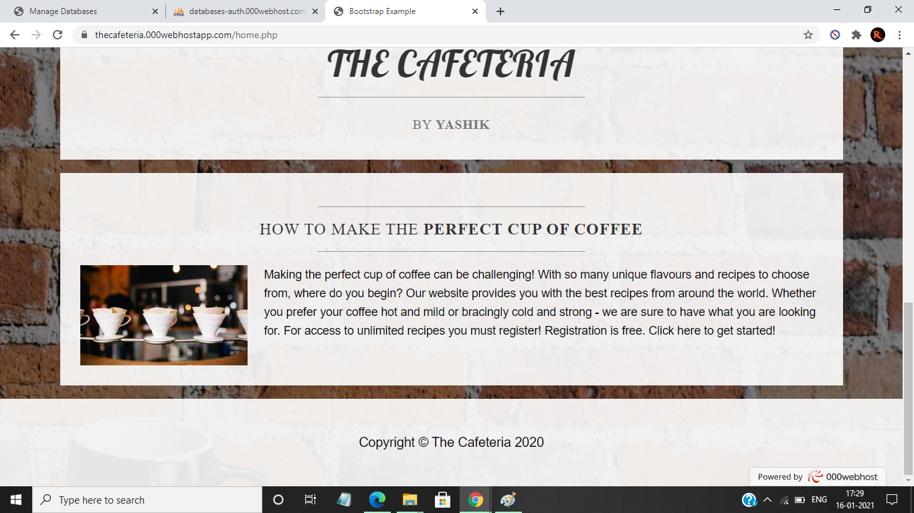

## Blog Page

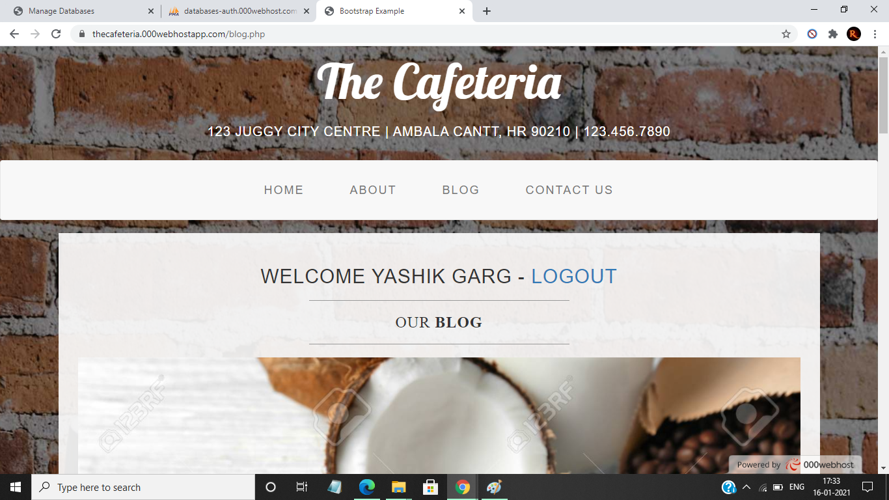&nbsp;&nbsp;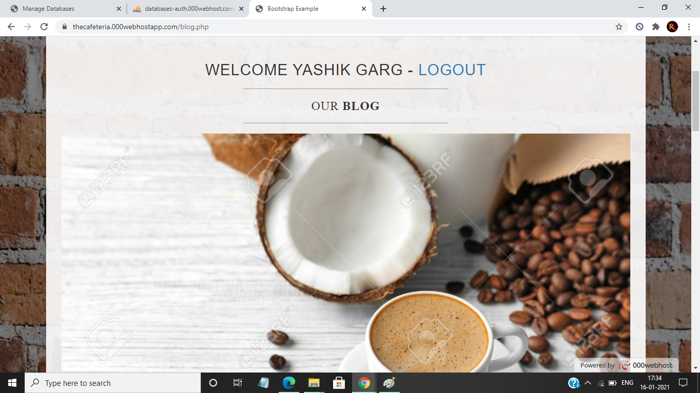
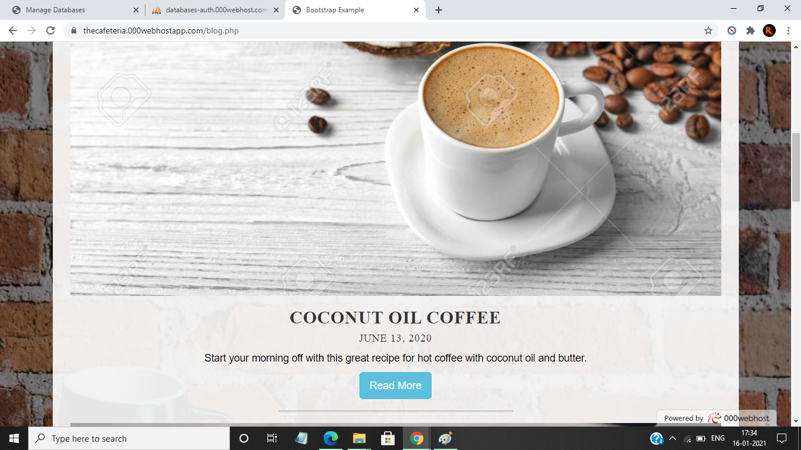&nbsp;&nbsp;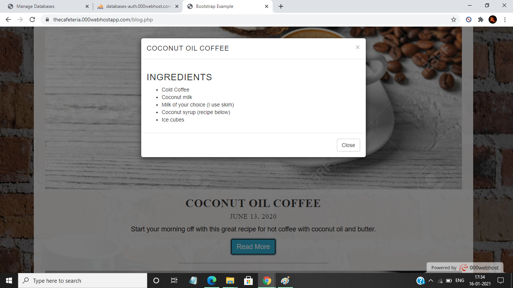

## Login/Register Page

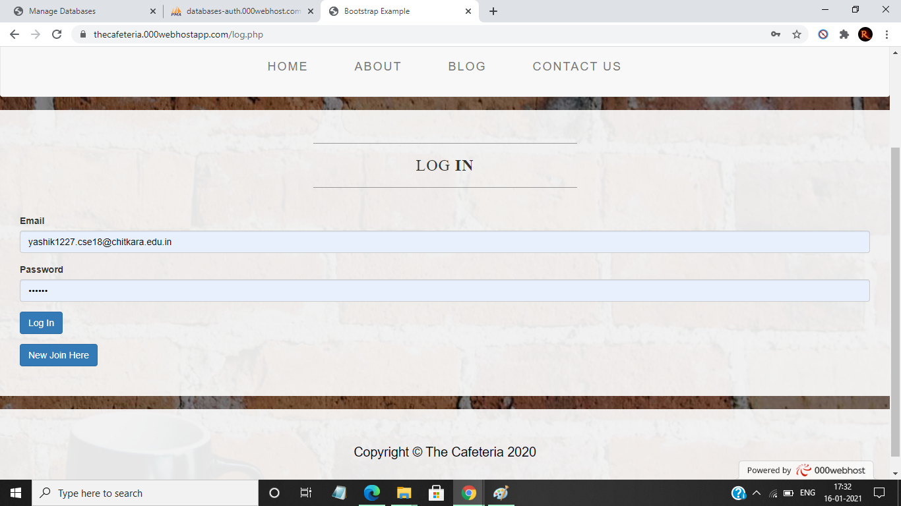&nbsp;&nbsp;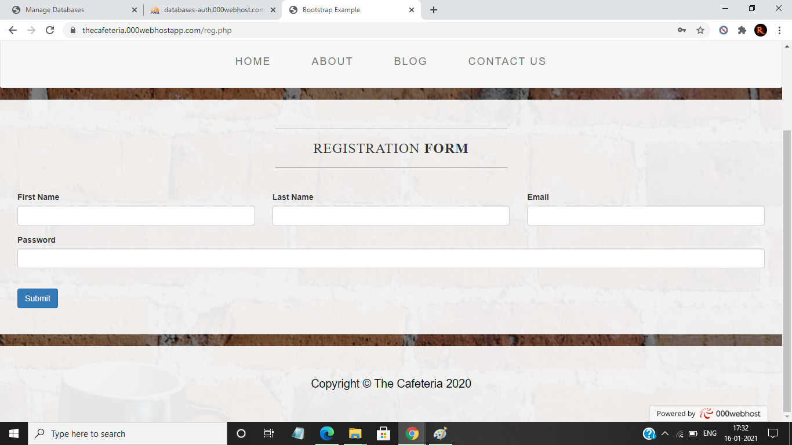

## Database

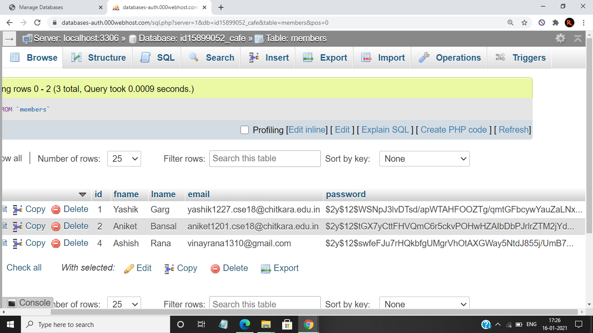

## Contact Page

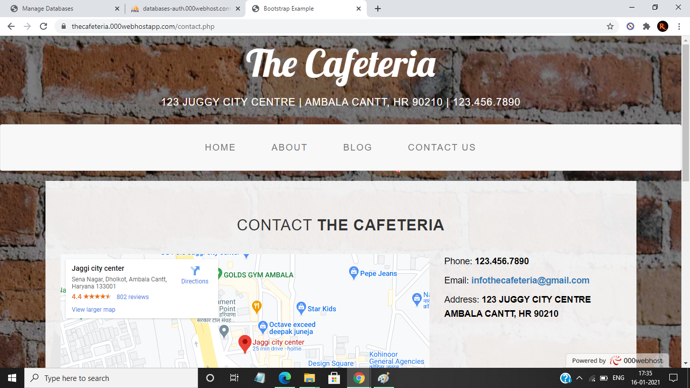&nbsp;&nbsp;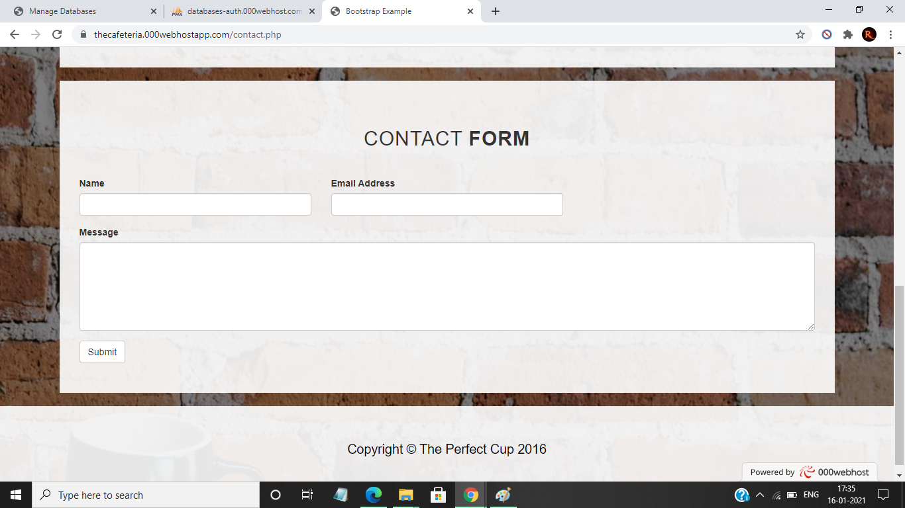

___

# ☁ Remeber

After Clonning Make Changes Of Database Infornation  in <b> add.php(Ln 3) , check.php(Ln 3) and sendmsg.php(Ln 4)</b>

<b>Replace This - </b>
```
$conn=new mysqli('localhost','root','','cafe');
```
<b>With - </b>

```
$conn=new mysqli('localhost',Your_DB_User,Your_DB_Password,Your_DB_Name);
```
And Also Replace YOUR Eamil And Password In <b>sendmsg.php(Ln 52,Ln 53,Ln 60) - 
```
53. $mail->Username = 'infothecafeteria@gmail.com';    //Replace With Your Mail
54. $mail->Password = 'xxxxxxxxxxxx';                  //Replace With Your Mail Password 
```
```
60. $mail->addAddress('infothecafeteria@gmail.com', 'Admin');  //Replace With Your  Recipient
```
<b> And For Creating Database Use This Command - </b>

```
CREATE TABLE IF NOT EXISTS `members` (
  `id` int(11) NOT NULL AUTO_INCREMENT,
  `fname` varchar(50) COLLATE utf8_unicode_ci NOT NULL,
  `lname` varchar(50) COLLATE utf8_unicode_ci NOT NULL,
  `email` varchar(100) COLLATE utf8_unicode_ci NOT NULL,
  `password` varchar(250) COLLATE utf8_unicode_ci NOT NULL,
  PRIMARY KEY (`id`)
) ENGINE=MyISAM AUTO_INCREMENT=12 DEFAULT CHARSET=utf8 COLLATE=utf8_unicode_ci;

```

___
> If You ♥ It Please Drop a ⭐ 😉
